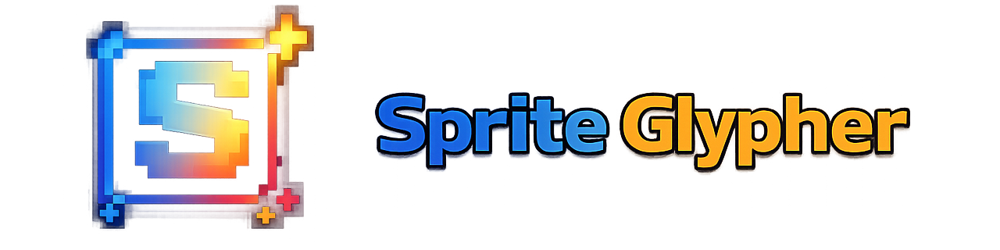
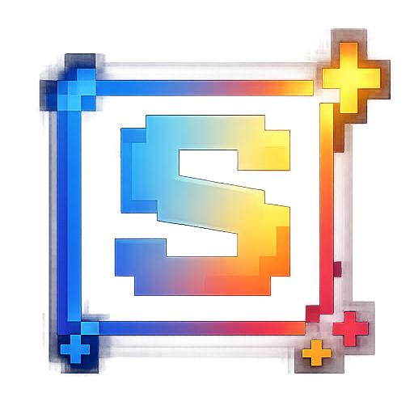
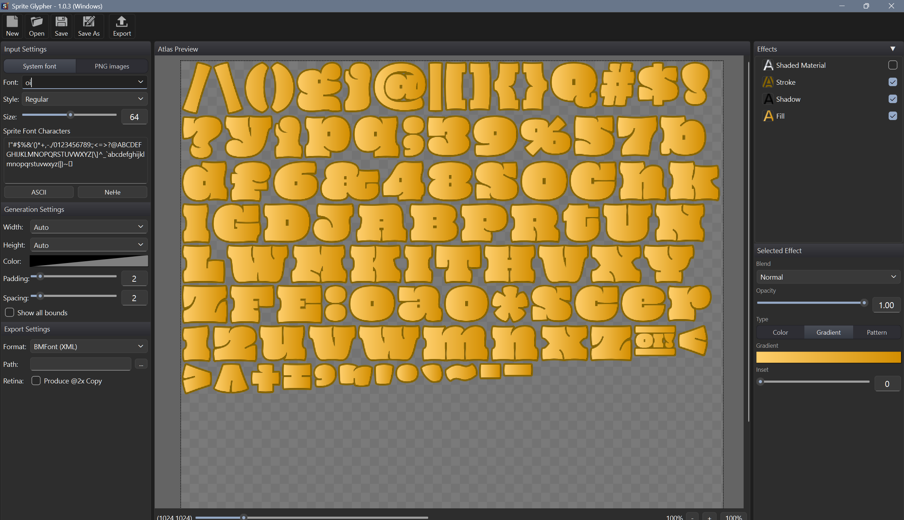

# Sprite Glypher

  

**Sprite Glypher** is a desktop **bitmap font** editor built for **games and applications** where text must look **exactly the same** on every device: you design the look once, bake glyphs into a **texture atlas**, and export layout data your engine or UI layer can consume—without relying on live vector rendering.

---

## Why bitmap fonts?

For many 2D games and stylized apps, pre-rendered glyphs give you **predictable art direction**, **fast drawing** (same cost as sprites), and **consistent output** across platforms. Sprite Glypher helps you go from **TrueType/OpenType** sources to a **PNG atlas** plus a **metrics file** your toolchain already understands.

---

## Highlights

- **Layered effects** — stack fill, stroke, and shadow; work with solid colors, gradients, and image-based fills where supported.
- **Project files** — save your work as `.sgf` and iterate without losing settings.
- **Export** — PNG atlas plus **BMFont-compatible** descriptors (ASCII, XML, binary, JSON) for common game and tool pipelines.
- **Hi-DPI** — optional **@2x** export for sharp assets on high-density screens.

---

## Engine & platform compatibility

Exports are a **PNG atlas** plus **BMFont-compatible** layout files (the same family of formats produced by [AngelCode BMFont](http://www.angelcode.com/products/bmfont/)). Anything that can load **`.fnt` / XML / binary / JSON + texture** (or you wire a small loader) can use these assets.

| Area | Examples |
|------|----------|
| **Flash / Stage3D** | [Starling](https://gamua.com/starling/) — `BitmapFont` + texture. |
| **iOS (legacy)** | [Sparrow](https://github.com/PrimaryFeather/Sparrow-Framework) — bitmap font + atlas (same general pipeline as Starling). |
| **Cocos** | **Cocos2d-x**, **Cocos Creator** — bitmap / BMFont-style labels (`LabelBMFont`, Creator **Label** with BMFont). The original **Cocos2d** (Objective-C) is unmaintained; Creator is the active Cocos product line. |
| **Java / Kotlin** | [LibGDX](https://libgdx.com/) — `BitmapFont` from BMFont exports. |
| **C# / .NET** | [MonoGame](https://www.monogame.net/), [FNA](https://github.com/FNA-XNA/FNA) — `SpriteFont`-style content or BMFont loaders from the community. |
| **Godot** | [BitmapFont](https://docs.godotengine.org/) — import `.fnt` + image (check version docs for exact import path). |
| **Lua** | [LÖVE](https://love2d.org/) — via libraries that read BMFont data; [Defold](https://defold.com/) — bitmap font from `.fnt` + texture. |
| **Haxe** | [Heaps](https://heaps.io/), [OpenFL](https://www.openfl.org/) / HaxeFlixel — bitmap text pipelines. |
| **JavaScript / TypeScript** | [Phaser](https://phaser.io/), [PixiJS](https://pixijs.com/) — bitmap/XML font workflows. |
| **Unity** | Not the native TextMeshPro pipeline; use **Asset Store** or community **BMFont importers** that consume XML/JSON + PNG. |
| **Unreal Engine** | Not a first-class UI font format; use **plugins** or a **custom importer** for atlas + metrics. |
| **Custom engines** | Any toolkit that parses BMFont fields and samples the atlas. |

If your stack is not listed, search for **“BMFont”**, **“AngelCode font”**, or **“bitmap font `.fnt`”** in that engine’s docs or asset store—support is usually a small importer or built-in bitmap label type.

---

  

  

---

## Download

Windows release https://github.com/Fluocode/SpriteGlypher/releases/download/Windows/SpriteGlypher.exe

---

Sprite Glypher is an independent open-source project.

***
If You like what I make please donate:

*** 
